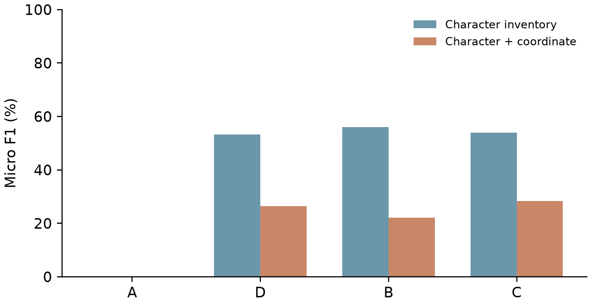

# Main Quest 03 - 공간 한글 자모 생성과 좌표 보조학습

**10회 학습 추가 실험 완료 · IEEEtran journal 영문 원고 6쪽 · 탐색적 구성요소 비교**

- [제출용 영문 논문 PDF](온19기_MainQuest3_강지수.pdf) · [LaTeX 소스](paper/main.tex) · [참고문헌](paper/references.bib)
- [Overleaf 프로젝트](https://ko.overleaf.com/project/6ab37405a2c5d1be09722e66) · 작성자 계정에서 편집 · 공개 공유 권한 변경 없음
- [한국어 설명·분석 노트북](Quest03.ipynb) · [최초 5회 실험 노트북](Original_5epoch.ipynb)
- [실제 실행 Colab](https://colab.research.google.com/drive/18lUqbarOzuOhBdfQMb5ozs56AIAYQ8fb)
- [상세 결과 해석](extension_v2/report/INTERPRETATION.md) · [기반 모델 분석](extension_v2/BASELINE_ANALYSIS.md) · [학습 개념 설명](extension_v2/읽는_순서.md)

## 연구 질문과 결론

- 질문: 한 가지 고정 자모 배치에서 좌표 보조학습이 자모 목록 보조학습보다 완전한 생성 성능을 높이는가?
- 결론: C의 문자·좌표 F1은 B보다 6.25%p 높지만 완전 정답은 둘 다 0/25. 완전 생성 개선 미확인.
- 미세 조정·5→10회 학습에서 부분 점수 개선 관찰. 변환만 학습한 D가 테스트 1/25 정답.
- OCR 파일럿은 자모 목록 정답 0/10. 본 실험은 OCR 인식 좌표가 아닌 합성 좌표 사용.
- 단일 시드·소량 자료·기존 테스트 재사용·조건별 계산량 차이를 가진 탐색 결과.

| 조건 | 10회차 테스트 완전 정답 | 문자 목록 F1 | 문자·좌표 F1 |
|---|---:|---:|---:|
| A: 추가학습 전 | 0/25 | 0.16% | 0.16% |
| D: 변환만 | 1/25 | 53.30% | 26.36% |
| B: 변환+목록 | 0/25 | 55.98% | 22.16% |
| C: 변환+좌표 | 0/25 | 53.91% | 28.41% |



## 실험 자료와 재현

- [추가 실험 원시 출력 372개](extension_v2/raw) · [고정 계획](extension_v2/frozen_plan.json) · [학습 로그](extension_v2/training)
- [전체 집계](extension_v2/report/results.json) · [실행 기록](extension_v2/execution_status.json)
- `python -m evaluation.verify_public_extension`: GPU 없이 원시 출력 재채점·저장 집계 대조
- `training/reproduce_extension.py`: 새 폴더에서만 추가 실험 재학습 · `--run-training` 지정 필요 · 기본 실행은 학습 시작 안 함
- 학습 198 / 검증 25 / 테스트 25 · D/B/C 각각 같은 기반 모델부터 10회 · 5·10회차 고정 평가
- [최초 실험 원시 출력](evaluation/raw)과 [최초 선택 기록](evaluation/frozen_selection.json)은 이력으로 유지
- 최초 5회 실험의 선택 체크포인트는 **1회차** · 추가 실험의 고정 5회차와 구분
- 학습 어댑터 전체는 로컬 실행 기록에 보존 · 공개 저장소의 어댑터는 기존 데모용 B 1회차

## 임시 데모

- [임시 데모 링크](https://cfe69f138f13baaae8.gradio.live) · Colab 세션 종료 시 중단 가능 · 이번 게시에서 가동 여부 재검증하지 않음
- 모델: 최초 실험 B 1회차 · 테스트 완전 정답 **0/25** · 출력 교정·대체 없음
- 추가 10회 모델로 교체하지 않음 · 데모에서 제공하던 PDF는 최초 5회 실험판일 수 있음
- 최신 논문은 위 제출용 PDF 사용 · 저장 출력 재현 3/3은 기존 배포 점검 결과
- [데모 기록](runs/DEMO_RECORD.md) · [모델 카드](MODEL_CARD.md)

## 논문 형식과 과제 연결

- IEEEtran journal 형식 · 실제 학술지 투고·게재를 의미하지 않음
- 최근 선행 연구 4건을 서론·이론적 배경·가설 근거에 직접 인용
- 사전학습 백본을 과업별로 미세 조정하는 Hugging Face 커스텀 프로젝트 흐름
- Overleaf 컴파일 오류 0 · 경고 0 · 조판 안내 5건. PDF 다운로드는 조직 정책으로 차단되어 동일 소스의 로컬 컴파일 PDF 제출
- [편집·컴파일 기록](paper/EDITORIAL_RECORD.md)

아래 동료 평가 양식은 원본을 보존했으며 작성자가 평가를 대신 체크하지 않았습니다.

---

# AIFFEL Campus Online Code Peer Review Templete
- 코더 : 코더의 이름을 작성하세요.
- 리뷰어 : 리뷰어의 이름을 작성하세요.


# PRT(Peer Review Template)
- [ ]  **1. 주어진 문제를 해결하는 완성된 코드가 제출되었나요?**
    - 문제에서 요구하는 최종 결과물이 첨부되었는지 확인
        - 중요! 해당 조건을 만족하는 부분을 캡쳐해 근거로 첨부
    
- [ ]  **2. 전체 코드에서 가장 핵심적이거나 가장 복잡하고 이해하기 어려운 부분에 작성된 
주석 또는 doc string을 보고 해당 코드가 잘 이해되었나요?**
    - 해당 코드 블럭을 왜 핵심적이라고 생각하는지 확인
    - 해당 코드 블럭에 doc string/annotation이 달려 있는지 확인
    - 해당 코드의 기능, 존재 이유, 작동 원리 등을 기술했는지 확인
    - 주석을 보고 코드 이해가 잘 되었는지 확인
        - 중요! 잘 작성되었다고 생각되는 부분을 캡쳐해 근거로 첨부
        
- [ ]  **3. 에러가 난 부분을 디버깅하여 문제를 해결한 기록을 남겼거나
새로운 시도 또는 추가 실험을 수행해봤나요?**
    - 문제 원인 및 해결 과정을 잘 기록하였는지 확인
    - 프로젝트 평가 기준에 더해 추가적으로 수행한 나만의 시도, 
    실험이 기록되어 있는지 확인
        - 중요! 잘 작성되었다고 생각되는 부분을 캡쳐해 근거로 첨부
        
- [ ]  **4. 회고를 잘 작성했나요?**
    - 주어진 문제를 해결하는 완성된 코드 내지 프로젝트 결과물에 대해
    배운점과 아쉬운점, 느낀점 등이 기록되어 있는지 확인
    - 전체 코드 실행 플로우를 그래프로 그려서 이해를 돕고 있는지 확인
        - 중요! 잘 작성되었다고 생각되는 부분을 캡쳐해 근거로 첨부
        
- [ ]  **5. 코드가 간결하고 효율적인가요?**
    - 파이썬 스타일 가이드 (PEP8) 를 준수하였는지 확인
    - 코드 중복을 최소화하고 범용적으로 사용할 수 있도록 함수화/모듈화했는지 확인
        - 중요! 잘 작성되었다고 생각되는 부분을 캡쳐해 근거로 첨부


# 회고(참고 링크 및 코드 개선)
```
# 리뷰어의 회고를 작성합니다.
# 코드 리뷰 시 참고한 링크가 있다면 링크와 간략한 설명을 첨부합니다.
# 코드 리뷰를 통해 개선한 코드가 있다면 코드와 간략한 설명을 첨부합니다.
```
